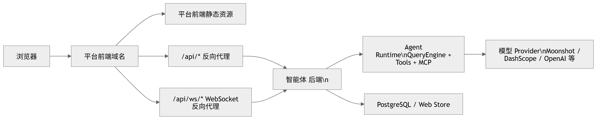
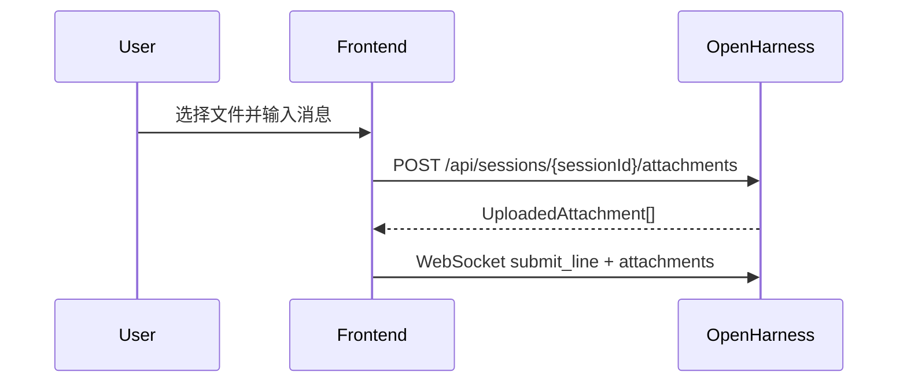
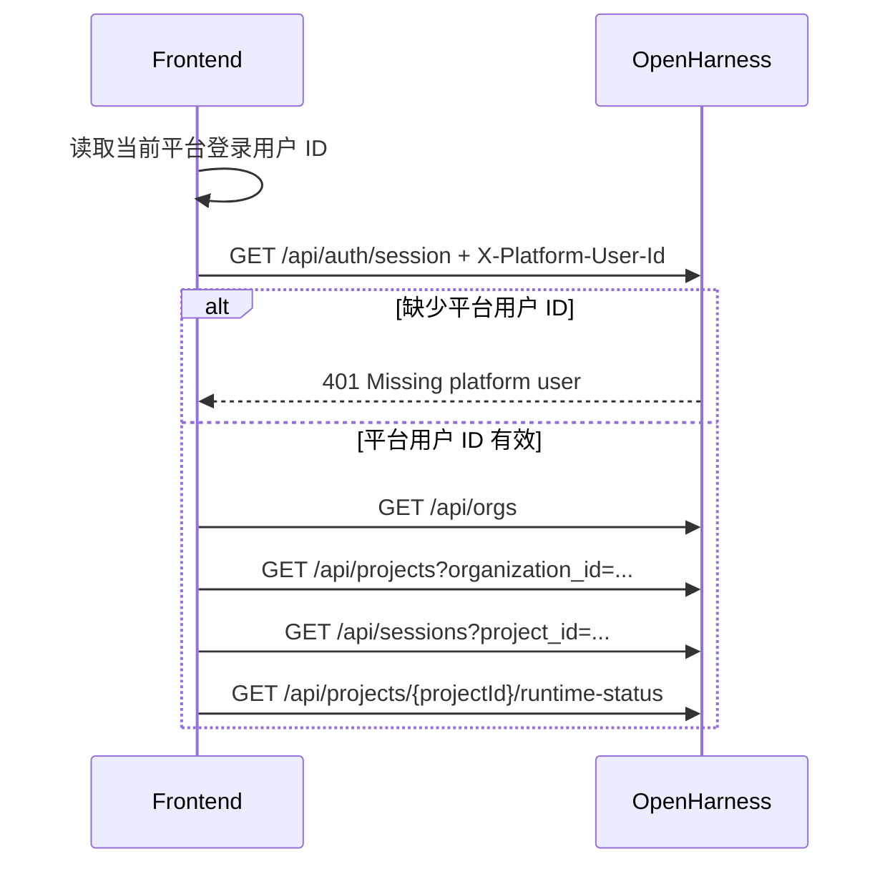
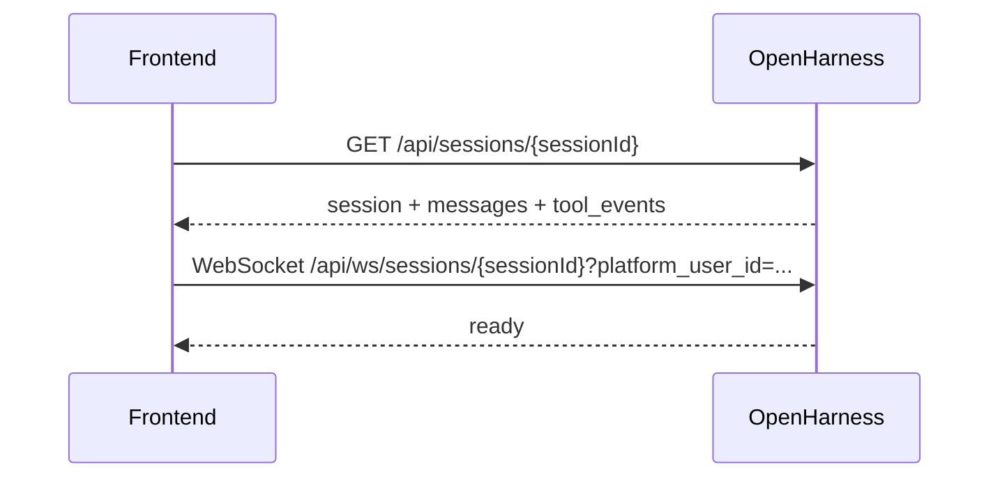
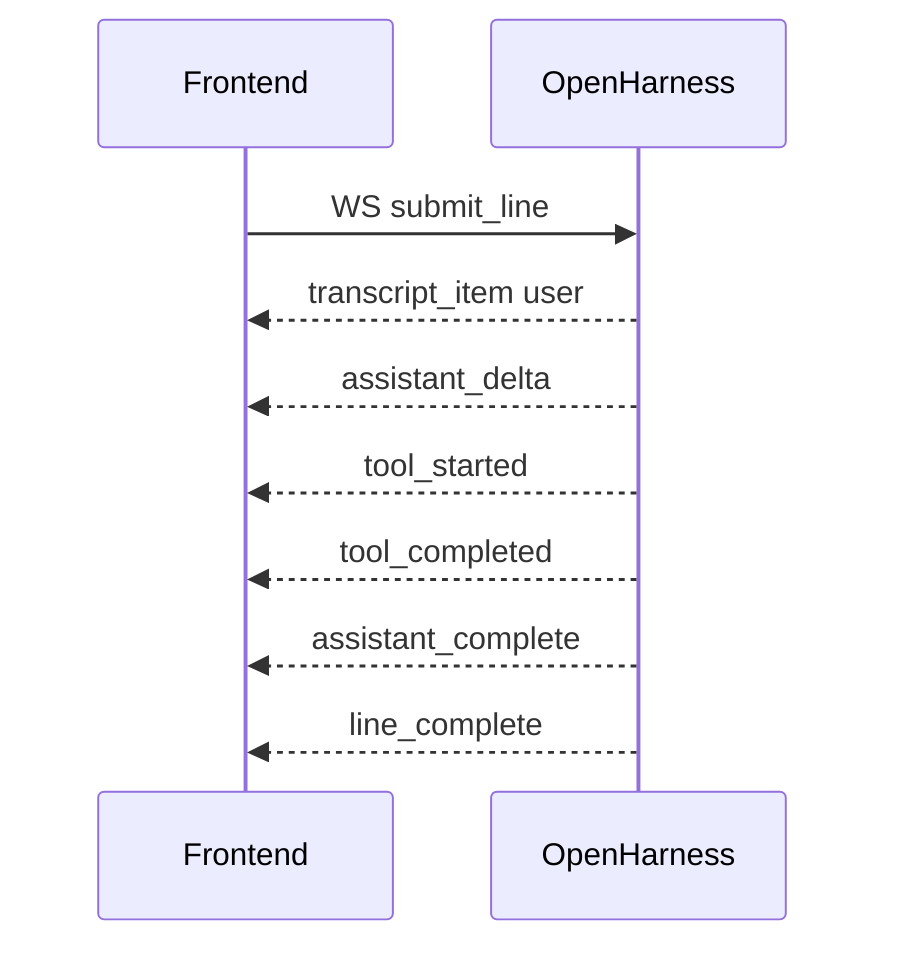
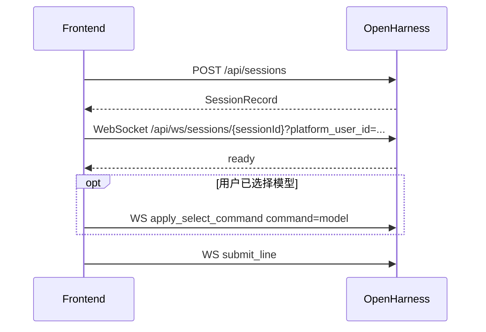

# OpenHarness 前端接口对接技术文档

本文用于指导其他前端团队对接 OpenHarness 智能体服务。接口口径包括 REST 接口、WebSocket 协议、运行态事件、附件、模型选择、Instant / Thinking / Pro 模式切换等。

## 1. 总体接入方式

推荐前端通过同源代理访问后端，避免浏览器直接跨域访问 OpenHarness 服务。




推荐代理规则：

```text
/api/*     -> http://192.168.88.92:8787/api/*
/api/ws/*  -> ws://192.168.88.92:8787/api/ws/*
```

前端代码中建议：

```ts
const API_BASE = '';
```

也就是所有 HTTP 请求都访问同源 `/api`，WebSocket 也访问同源 `/api/ws/...`。

### 1.1 直连平台用户身份模式

当前内部自测接入采用智能体服务直连模式，智能体 Web 后端不再要求平台前端跳转 OpenHarness 登录页。平台前端必须在调用智能体接口时附带当前平台登录用户 ID，智能体服务用该 ID 映射内部用户，并按用户隔离组织、项目、会话、附件与 WebSocket 运行态。

HTTP 请求统一附带：

```http
X-Platform-User-Id: <当前平台登录用户ID>
X-Platform-User-Name: <当前平台用户显示名，可选>
X-Platform-User-Email: <当前平台用户邮箱，可选>
```

WebSocket 连接使用 query 参数传递用户 ID：

```text
/api/ws/sessions/{sessionId}?platform_user_id=<当前平台登录用户ID>
```

注意：该模式依赖平台前端传入的用户 ID 做逻辑隔离，适合内网自测和过渡接入。浏览器侧参数可被调试工具篡改，若用于生产环境，应改为统一 OIDC/SSO 或平台后端签发可信短期票据。

## 2. 前端基础封装

### 2.1 HTTP 请求封装

```ts
const API_BASE = import.meta.env.VITE_OPENHARNESS_API_BASE ?? '';
const PLATFORM_USER_STORAGE_KEY = 'openharness.platformUser';

type PlatformIdentity = {
  id: string;
  name?: string;
  email?: string;
};

function platformIdentity(): PlatformIdentity {
  const params = new URLSearchParams(window.location.search);
  const fromQuery = {
    id: params.get('platform_user_id') ?? params.get('userId') ?? '',
    name: params.get('platform_user_name') ?? '',
    email: params.get('platform_user_email') ?? '',
  };
  if (fromQuery.id) {
    window.localStorage.setItem(PLATFORM_USER_STORAGE_KEY, JSON.stringify(fromQuery));
    return normalizePlatformIdentity(fromQuery);
  }
  const stored = window.localStorage.getItem(PLATFORM_USER_STORAGE_KEY);
  if (stored) {
    try {
      return normalizePlatformIdentity(JSON.parse(stored) as PlatformIdentity);
    } catch {
      window.localStorage.removeItem(PLATFORM_USER_STORAGE_KEY);
    }
  }
  return normalizePlatformIdentity({
    id: import.meta.env.VITE_PLATFORM_USER_ID ?? 'platform-demo-user',
    name: import.meta.env.VITE_PLATFORM_USER_NAME ?? 'Platform Demo User',
    email: import.meta.env.VITE_PLATFORM_USER_EMAIL ?? '',
  });
}

function normalizePlatformIdentity(identity: PlatformIdentity): PlatformIdentity {
  const id = String(identity.id || '').trim() || 'platform-demo-user';
  return {
    id,
    name: identity.name ? String(identity.name).trim() : undefined,
    email: identity.email ? String(identity.email).trim() : undefined,
  };
}

function platformIdentityHeaders(): Record<string, string> {
  const identity = platformIdentity();
  return {
    'X-Platform-User-Id': identity.id,
    ...(identity.name ? {'X-Platform-User-Name': identity.name} : {}),
    ...(identity.email ? {'X-Platform-User-Email': identity.email} : {}),
  };
}

async function requestJson<T>(path: string, init?: RequestInit): Promise<T> {
  const response = await fetch(`${API_BASE}${path}`, {
    credentials: 'include',
    ...init,
    headers: {
      'content-type': 'application/json',
      ...platformIdentityHeaders(),
      ...(init?.headers ?? {}),
    },
  });

  if (!response.ok) {
    const text = await response.text();
    throw new Error(text || `${response.status} ${response.statusText}`);
  }

  return response.json() as Promise<T>;
}
```

说明：

- 当前直连平台用户身份模式下，所有 REST 请求都必须带 `X-Platform-User-Id`。
- `credentials: 'include'` 仍保留，用于兼容 OIDC/Cookie 模式或后续切换。
- JSON 请求默认加 `content-type: application/json`。
- 附件上传不能复用 JSON 封装，因为 `multipart/form-data` 需要浏览器自动生成 boundary；但仍要显式加平台用户身份头。

### 2.2 WebSocket URL 封装

```ts
function webSocketUrl(sessionId: string) {
  const base = API_BASE || window.location.origin;
  const url = new URL(base, window.location.origin);
  url.protocol = url.protocol === 'https:' ? 'wss:' : 'ws:';
  url.pathname = `/api/ws/sessions/${encodeURIComponent(sessionId)}`;
  url.search = '';
  url.searchParams.set('platform_user_id', platformIdentity().id);
  return url.toString();
}
```

### 2.3 request_id 生成

```ts
function newRequestId() {
  return `req_${Math.random().toString(16).slice(2)}${Date.now().toString(16)}`;
}
```

`request_id` 用于关联前端请求、后端事件、权限确认、追问弹窗等。前端生成即可，保证当前会话内基本唯一。

## 3. REST 接口

| 功能 | 方法 | 路径 |
| --- | --- | --- |
| 查询登录态 | GET | `/api/auth/session` |
| 退出登录 | POST | `/api/auth/logout` |
| 获取组织列表 | GET | `/api/orgs` |
| 获取项目列表 | GET | `/api/projects?organization_id=...` |
| 获取会话列表 | GET | `/api/sessions?project_id=...` |
| 创建会话 | POST | `/api/sessions` |
| 更新会话 | PATCH | `/api/sessions/{sessionId}` |
| 删除会话 | DELETE | `/api/sessions/{sessionId}` |
| 获取会话详情 | GET | `/api/sessions/{sessionId}` |
| 上传附件 | POST | `/api/sessions/{sessionId}/attachments` |
| 获取项目运行态 | GET | `/api/projects/{projectId}/runtime-status` |

## 4. 认证接口

### 4.1 查询登录态

```http
GET /api/auth/session
```

响应：

```ts
type AuthSessionResponse = {
  authenticated: boolean;
  login_url?: string;
  user?: Record<string, unknown>;
};
```

示例：

```json
{
  "authenticated": true,
  "user": {
    "id": "user_demo",
    "email": "demo@openharness.local",
    "name": "OpenHarness"
  }
}
```

未登录示例：

```json
{
  "authenticated": false,
  "login_url": "/api/auth/login"
}
```

直连平台用户身份模式下，如果请求缺少 `X-Platform-User-Id`，后端会返回 `401 Missing platform user`。平台前端不应跳转 OpenHarness 登录页，而应确认是否已经拿到当前平台登录用户 ID，并在所有请求中补齐身份头。

前端处理建议：

```ts
const session = await authSession();
if (!session.authenticated) {
  throw new Error('Missing platform user identity');
}
```

### 4.2 退出登录

```http
POST /api/auth/logout
```

前端当前实现：

```ts
fetch(`${API_BASE}/api/auth/logout`, {
  method: 'POST',
  credentials: 'include',
  headers: platformIdentityHeaders(),
});
```

## 5. 组织与项目接口

### 5.1 获取组织列表

```http
GET /api/orgs
```

响应：

```ts
type OrganizationRecord = {
  id: string;
  name: string;
  created_at: string;
};
```

示例：

```json
[
  {
    "id": "org_demo",
    "name": "OpenHarness",
    "created_at": "2026-05-08T00:00:00+00:00"
  }
]
```

### 5.2 获取项目列表

```http
GET /api/projects?organization_id={organizationId}
```

响应：

```ts
type ProjectRecord = {
  id: string;
  organization_id: string;
  name: string;
  created_at: string;
};
```

示例：

```json
[
  {
    "id": "proj_demo",
    "organization_id": "org_demo",
    "name": "Default Project",
    "created_at": "2026-05-08T00:00:00+00:00"
  }
]
```

## 6. 会话 REST 接口

### 6.1 获取会话列表

```http
GET /api/sessions?project_id={projectId}
```

响应：

```ts
type SessionRecord = {
  id: string;
  organization_id: string;
  project_id: string;
  title: string;
  archived: boolean;
  pinned: boolean;
  created_at: string;
  updated_at: string;
};
```

说明：

- 后端返回未归档会话。
- 当前后端按 `pinned` 和 `updated_at` 排序。

### 6.2 创建会话

```http
POST /api/sessions
Content-Type: application/json
```

请求：

```json
{
  "organization_id": "org_demo",
  "project_id": "proj_demo",
  "title": "New chat"
}
```

响应：`SessionRecord`

使用场景：

- 用户在无当前会话页面发送第一条消息时，前端先创建会话，再建立 WebSocket，再发送消息。

### 6.3 获取会话详情

```http
GET /api/sessions/{sessionId}
```

响应：

```ts
type SessionDetail = {
  session: SessionRecord;
  messages: Array<{
    id: string;
    role: string;
    text: string;
    created_at: string;
  }>;
  tool_events: ToolFeedback[];
};
```

说明：

- 页面打开已有会话时先调用该接口加载历史消息。
- 历史消息加载后，再建立 WebSocket 接收实时事件。

### 6.4 更新会话

```http
PATCH /api/sessions/{sessionId}
Content-Type: application/json
```

请求：

```json
{
  "title": "新的会话标题",
  "pinned": true
}
```

字段说明：

- `title` 可选，用于重命名。
- `pinned` 可选，用于置顶或取消置顶。

响应：`SessionRecord`

### 6.5 删除会话

```http
DELETE /api/sessions/{sessionId}
```

响应：

```json
{
  "ok": true
}
```

说明：

- 后端当前是归档会话，不是物理删除。
- 如果删除的是当前打开会话，前端应跳回项目页或切换到其他会话。

## 7. 附件接口

### 7.1 上传附件

```http
POST /api/sessions/{sessionId}/attachments
X-Platform-User-Id: <当前平台登录用户ID>
Content-Type: multipart/form-data
```

表单字段：

```text
files: File[]
```

响应：

```ts
type UploadedAttachment = {
  id: string;
  name: string;
  mime_type: string;
  size: number;
  path: string;
  is_image: boolean;
  preview_url?: string | null;
};
```

示例：

```json
{
  "attachments": [
    {
      "id": "att_abc123",
      "name": "screenshot.png",
      "mime_type": "image/png",
      "size": 12345,
      "path": "/server/sandbox/path/att_abc123_screenshot.png",
      "is_image": true,
      "preview_url": "/api/sessions/sess_abc/attachments/att_abc123"
    }
  ]
}
```

前端流程：



注意：

- 附件必须先上传，不能直接通过 WebSocket 发送原始 File。
- WebSocket 中传的是 `UploadedAttachment[]`。
- 图片附件会带 `preview_url`，可用于前端展示预览。
- 当前前端 Nginx 代理通过 `CLIENT_MAX_BODY_SIZE` 控制请求体上限；智能体后端仍应继续补充单文件大小、总文件数、MIME 白名单等服务端校验。

## 8. 项目运行态接口

### 8.1 获取项目运行态

```http
GET /api/projects/{projectId}/runtime-status
```

响应示例：

```json
{
  "project_id": "proj_demo",
  "sandbox_root": "/home/user/.openharness/web_sandboxes",
  "budget": {
    "organization_id": "org_demo",
    "daily_token_limit": 2000000,
    "concurrent_session_limit": 10,
    "used_input_tokens": 0,
    "used_output_tokens": 0
  },
  "model": "kimi-k2.5",
  "provider": "moonshot",
  "effort": "medium",
  "model_options": [
    {
      "value": "moonshot:kimi-k2.5",
      "label": "Moonshot (Kimi) / kimi-k2.5",
      "description": "moonshot / moonshot_api_key",
      "active": true
    }
  ]
}
```

当前前端用途：

- 展示右侧 Inspector 的 runtime / budget 信息。
- 在未进入会话或 WebSocket 尚未 ready 时，为配置弹窗提供初始 `model_options`。

## 9. WebSocket 连接

### 9.1 连接地址

```text
/api/ws/sessions/{sessionId}?platform_user_id=<当前平台登录用户ID>
```

前端应根据当前页面协议自动选择：

- HTTP 页面：`ws://...`
- HTTPS 页面：`wss://...`

### 9.2 建立连接时机

进入具体会话页面时建立连接：

```ts
const socket = new WebSocket(webSocketUrl(sessionId));
```

如果缺少 `platform_user_id`，或传入的用户无权访问该会话，智能体后端会拒绝 WebSocket 握手或关闭连接。

切换会话时：

- 清空当前实时状态。
- 关闭旧 WebSocket。
- 创建新 WebSocket。

### 9.3 断开处理

`onclose` 或 `onerror` 时：

- `connected=false`
- `busy=false`
- 前端可显示“连接已断开”
- 可提供重连按钮

## 10. WebSocket 前端请求协议

当前前端实际发送以下类型：

```ts
type WebFrontendRequest =
  | {type: 'submit_line'; request_id: string; line: string; attachments?: UploadedAttachment[]}
  | {type: 'permission_response'; request_id: string; allowed: boolean}
  | {type: 'question_response'; request_id: string; answer: string}
  | {type: 'select_command'; request_id: string; command: string}
  | {type: 'apply_select_command'; request_id: string; command: string; value: string}
  | {type: 'stop'; request_id: string}
  | {type: 'shutdown'; request_id: string};
```

### 10.1 发送用户消息

```json
{
  "type": "submit_line",
  "request_id": "req_001",
  "line": "请分析这个项目结构",
  "attachments": []
}
```

前端发送后应设置：

```ts
busy = true;
```

### 10.2 停止当前回答

```json
{
  "type": "stop",
  "request_id": "req_002"
}
```

当前前端发送后立即设置：

```ts
busy = false;
```

### 10.3 权限确认响应

后端发送 `modal_request`，且：

```json
{
  "kind": "permission"
}
```

前端允许：

```json
{
  "type": "permission_response",
  "request_id": "后端 modal.request_id",
  "allowed": true
}
```

前端拒绝：

```json
{
  "type": "permission_response",
  "request_id": "后端 modal.request_id",
  "allowed": false
}
```

### 10.4 追问回答

后端发送 `modal_request`，且：

```json
{
  "kind": "question"
}
```

前端回复：

```json
{
  "type": "question_response",
  "request_id": "后端 modal.request_id",
  "answer": "用户填写的答案"
}
```

### 10.5 请求选择项

```json
{
  "type": "select_command",
  "request_id": "req_003",
  "command": "model"
}
```

后端会返回 `select_request`，其中包含 `select_options`。

当前常用 command：

```text
model
provider
permissions
theme
output-style
effort
fast
resume
```

### 10.6 应用选择项

```json
{
  "type": "apply_select_command",
  "request_id": "req_004",
  "command": "model",
  "value": "moonshot:kimi-k2.5"
}
```

说明：

- `value` 应使用后端返回的 `select_options[].value`。
- 不建议前端自行拼接模型值或 provider profile。

## 11. Instant / Thinking / Pro 模式切换

当前 `agent_web` 的三种模式对应 OpenHarness 的 `effort`：

| 前端展示 | 后端 command | value |
| --- | --- | --- |
| Instant | `effort` | `low` |
| Thinking | `effort` | `medium` |
| Pro | `effort` | `high` |

切换 Instant：

```json
{
  "type": "apply_select_command",
  "request_id": "req_effort_low",
  "command": "effort",
  "value": "low"
}
```

切换 Thinking：

```json
{
  "type": "apply_select_command",
  "request_id": "req_effort_medium",
  "command": "effort",
  "value": "medium"
}
```

切换 Pro：

```json
{
  "type": "apply_select_command",
  "request_id": "req_effort_high",
  "command": "effort",
  "value": "high"
}
```

后端处理逻辑：

- WebSocket 收到 `apply_select_command`。
- `command=effort` 会转换成内部 slash command：`/effort low|medium|high`。
- 后端刷新 runtime 状态并返回 `state_snapshot` 或 `line_complete`。

注意：

- 当前 REST `POST /api/sessions/{sessionId}/commands` 不支持 `effort`。
- Instant / Thinking / Pro 实时切换应走 WebSocket。
- 如果尚未创建会话，前端可先保存用户选择，等会话创建并 WebSocket ready 后再发送。

## 12. 模型选择

### 12.1 模型选项来源

模型选项可以从两个位置获得。

第一，项目运行态接口：

```http
GET /api/projects/{projectId}/runtime-status
```

读取：

```json
{
  "model_options": []
}
```

第二，WebSocket `ready` 或 `state_snapshot`：

```json
{
  "type": "ready",
  "state": {
    "model_options": []
  }
}
```

当前前端合并逻辑：

- 优先使用 `status.model_options`。
- 如果没有模型选项，则用当前 `status.model` 构造一个当前模型项。
- 额外展示一些 disabled 示例项。

### 12.2 主动请求模型选项

```json
{
  "type": "select_command",
  "request_id": "req_model_options",
  "command": "model"
}
```

后端返回：

```json
{
  "type": "select_request",
  "modal": {
    "kind": "select",
    "title": "Model",
    "command": "model"
  },
  "select_options": [
    {
      "value": "moonshot:kimi-k2.5",
      "label": "Moonshot (Kimi) / kimi-k2.5",
      "description": "moonshot / moonshot_api_key",
      "active": true
    }
  ]
}
```

### 12.3 应用模型选择

```json
{
  "type": "apply_select_command",
  "request_id": "req_apply_model",
  "command": "model",
  "value": "moonshot:kimi-k2.5"
}
```

说明：

- `value` 必须取自后端返回的 `model_options[].value` 或 `select_options[].value`。
- 当前后端内部通常使用 `{profile}:{model}` 格式，例如：

```text
moonshot:kimi-k2.5
dashscope:qwen-plus
openai-compatible:gpt-5.4
```

### 12.4 新会话首条消息前选择模型

当前 `agent_web` 做法：

1. 用户在无会话状态下选择模型。
2. 前端先把模型值保存到本地 `modelChoice`。
3. 用户发送首条消息。
4. 前端调用 `POST /api/sessions` 创建会话。
5. 建立 WebSocket。
6. WebSocket ready 后先发送：

```json
{
  "type": "apply_select_command",
  "request_id": "req_apply_model",
  "command": "model",
  "value": "moonshot:kimi-k2.5"
}
```

7. 再发送：

```json
{
  "type": "submit_line",
  "request_id": "req_submit",
  "line": "用户首条消息"
}
```

## 13. WebSocket 后端事件协议

当前前端实际处理以下事件：

```text
ready
state_snapshot
tasks_snapshot
transcript_item
assistant_delta
assistant_complete
tool_started
tool_completed
modal_request
select_request
error
line_complete
```

基础字段：

```ts
type WebBackendEvent = {
  type: string;
  event_id: string;
  tenant_id: string;
  project_id: string;
  session_id: string;
  created_at: string;
  request_id?: string | null;
  message?: string | null;
  item?: TranscriptItem | null;
  state?: Record<string, unknown> | null;
  tasks?: TaskSnapshot[] | null;
  commands?: string[] | null;
  modal?: Record<string, unknown> | null;
  select_options?: SelectOptionPayload[] | null;
  tool_name?: string | null;
  tool_input?: Record<string, unknown> | null;
  output?: string | null;
  is_error?: boolean | null;
};
```

### 13.1 ready

运行时初始化完成。

```json
{
  "type": "ready",
  "state": {
    "model": "kimi-k2.5",
    "provider": "moonshot",
    "permission_mode": "default",
    "effort": "medium",
    "busy": false,
    "assistant_buffer": "",
    "model_options": []
  },
  "tasks": [],
  "commands": ["/help", "/model", "/provider"]
}
```

前端处理：

- 更新 `status`
- 更新 `tasks`
- 更新 `commands`
- 同步 `busy`
- 同步 `assistantBuffer`

### 13.2 state_snapshot

运行态刷新。

```json
{
  "type": "state_snapshot",
  "state": {
    "model": "kimi-k2.5",
    "provider": "moonshot",
    "effort": "medium",
    "busy": false,
    "assistant_buffer": "",
    "model_options": []
  }
}
```

### 13.3 tasks_snapshot

任务列表刷新。

```json
{
  "type": "tasks_snapshot",
  "tasks": []
}
```

### 13.4 transcript_item

新增一条转录消息。

```json
{
  "type": "transcript_item",
  "item": {
    "id": "msg_abc",
    "role": "user",
    "text": "请分析这个项目"
  }
}
```

### 13.5 assistant_delta

助手流式增量。

```json
{
  "type": "assistant_delta",
  "message": "正在分析"
}
```

前端处理：

- 追加到临时 `assistantBuffer`。
- 不要立即作为完整消息入库。

### 13.6 assistant_complete

助手完整回复结束。

```json
{
  "type": "assistant_complete",
  "message": "完整回答内容",
  "item": {
    "id": "msg_assistant",
    "role": "assistant",
    "text": "完整回答内容"
  }
}
```

前端处理：

- 将 `item` 加入 transcript。
- 清空 `assistantBuffer`。
- 设置 `busy=false`。

### 13.7 tool_started

工具开始。

```json
{
  "type": "tool_started",
  "tool_name": "Grep",
  "tool_input": {
    "pattern": "create_app"
  }
}
```

### 13.8 tool_completed

工具完成。

```json
{
  "type": "tool_completed",
  "tool_name": "Grep",
  "output": "工具输出",
  "is_error": false
}
```

前端建议：

- 工具调用不要直接混进主聊天流。
- 可以放在右侧事件面板、工具抽屉或折叠详情里。

### 13.9 modal_request

后端要求前端弹窗。

权限确认：

```json
{
  "type": "modal_request",
  "modal": {
    "kind": "permission",
    "request_id": "req_permission",
    "tool_name": "Bash",
    "reason": "Mutating tools require user confirmation in default mode"
  }
}
```

用户追问：

```json
{
  "type": "modal_request",
  "modal": {
    "kind": "question",
    "request_id": "req_question",
    "question": "请选择要操作的目录"
  }
}
```

### 13.10 select_request

后端返回可选项。

```ts
type SelectOptionPayload = {
  value: string;
  label: string;
  description?: string;
  active?: boolean;
  disabled?: boolean;
  badge?: string;
};
```

示例：

```json
{
  "type": "select_request",
  "modal": {
    "kind": "select",
    "title": "Model",
    "command": "model"
  },
  "select_options": [
    {
      "value": "moonshot:kimi-k2.5",
      "label": "Moonshot (Kimi) / kimi-k2.5",
      "description": "moonshot / moonshot_api_key",
      "active": true
    }
  ]
}
```

### 13.11 error

```json
{
  "type": "error",
  "message": "API error: ..."
}
```

前端处理：

- 加一条 system 消息，或 toast 展示。
- 清空 `assistantBuffer`。
- `busy=false`。

### 13.12 line_complete

```json
{
  "type": "line_complete"
}
```

前端处理：

- 清空 `assistantBuffer`。
- `busy=false`。

## 14. 前端状态管理建议

建议维护状态：

```ts
type OpenHarnessUiState = {
  connected: boolean;
  busy: boolean;
  events: WebBackendEvent[];
  transcript: TranscriptItem[];
  assistantBuffer: string;
  status: Record<string, unknown>;
  tasks: TaskSnapshot[];
  toolEvents: ToolFeedback[];
  commands: string[];
  modal: Record<string, unknown> | null;
  selectRequest: {
    title: string;
    command: string;
    options: SelectOptionPayload[];
  } | null;
};
```

事件处理规则：

| 事件 | 前端动作 |
| --- | --- |
| `ready` | 更新状态、任务、命令、busy、assistantBuffer |
| `state_snapshot` | 更新状态、busy、assistantBuffer |
| `tasks_snapshot` | 更新任务列表 |
| `transcript_item` | 追加消息 |
| `assistant_delta` | 累加临时回复 |
| `assistant_complete` | 追加助手完整消息，清空临时回复，busy=false |
| `tool_started` | 追加工具开始事件 |
| `tool_completed` | 追加工具完成事件 |
| `modal_request` | 打开权限或追问弹窗 |
| `select_request` | 打开选择弹窗 |
| `error` | 展示错误，清空临时回复，busy=false |
| `line_complete` | 清空临时回复，busy=false |

## 15. 当前前端典型流程

### 15.1 应用初始化



### 15.2 打开已有会话



### 15.3 发送消息



### 15.4 无会话状态下发送首条消息



## 16. TypeScript 类型汇总

```ts
export type OrganizationRecord = {
  id: string;
  name: string;
  created_at: string;
};

export type ProjectRecord = {
  id: string;
  organization_id: string;
  name: string;
  created_at: string;
};

export type SessionRecord = {
  id: string;
  organization_id: string;
  project_id: string;
  title: string;
  archived: boolean;
  pinned: boolean;
  created_at: string;
  updated_at: string;
};

export type TranscriptItem = {
  id?: string | null;
  role: 'system' | 'user' | 'assistant' | 'tool' | 'tool_result' | 'log';
  text: string;
  tool_name?: string | null;
  tool_input?: Record<string, unknown> | null;
  is_error?: boolean | null;
};

export type TaskSnapshot = {
  id: string;
  type: string;
  status: string;
  description: string;
  metadata: Record<string, string>;
};

export type UploadedAttachment = {
  id: string;
  name: string;
  mime_type: string;
  size: number;
  path: string;
  is_image: boolean;
  preview_url?: string | null;
};

export type ToolFeedback = {
  id: string;
  phase: 'started' | 'completed';
  tool_name: string;
  tool_input?: Record<string, unknown> | null;
  output?: string | null;
  is_error?: boolean | null;
  created_at: string;
};
```

## 17. 错误处理建议

HTTP：

| 状态码 | 含义 | 前端处理 |
| --- | --- | --- |
| 400 | 请求参数错误 | 展示错误内容 |
| 401 | 未登录、登录过期或缺少 `X-Platform-User-Id` | 直连模式下检查平台用户 ID；OIDC 模式下跳转登录 |
| 403 | 无权限 | 展示无权限状态 |
| 404 | 资源不存在 | 回到项目或会话列表 |
| 500 | 服务端错误 | 展示错误并允许重试 |

WebSocket：

| 场景 | 前端处理 |
| --- | --- |
| `onclose` | connected=false, busy=false |
| `onerror` | connected=false, busy=false |
| 缺少 `platform_user_id` | 检查平台用户 ID 是否已附加到 WebSocket URL |
| 后端 `error` 事件 | 展示错误，busy=false |
| 长时间无响应 | 可提供停止按钮或重连按钮 |

## 18. 开发检查清单

- 能从平台登录态获取当前用户 ID。
- 所有 REST 请求都带 `X-Platform-User-Id`。
- WebSocket URL 都带 `platform_user_id` query 参数。
- 不带平台用户 ID 时，接口返回 `401`，前端不会跳转 OpenHarness 登录页。
- 能通过 `/api/auth/session` 判断登录态。
- 能获取组织、项目、会话列表。
- 能创建会话并跳转到会话页。
- 能加载历史消息和工具事件。
- 能建立 `/api/ws/sessions/{sessionId}` WebSocket。
- 能发送 `submit_line` 并显示流式回复。
- 能处理 `assistant_delta` 和 `assistant_complete`。
- 能处理工具开始和完成事件。
- 能处理权限确认弹窗。
- 能处理追问弹窗。
- 能上传附件，并随消息发送 `UploadedAttachment[]`。
- 能通过 `apply_select_command command=effort` 切换 Instant / Thinking / Pro。
- 能通过 `runtime-status` 或 WebSocket state 获取 `model_options`。
- 能通过 `apply_select_command command=model` 切换模型。
- WebSocket 断开后 UI 状态能恢复，并支持重连。
- 前端代码不包含服务器密码、模型 API Key 或其他密钥。
